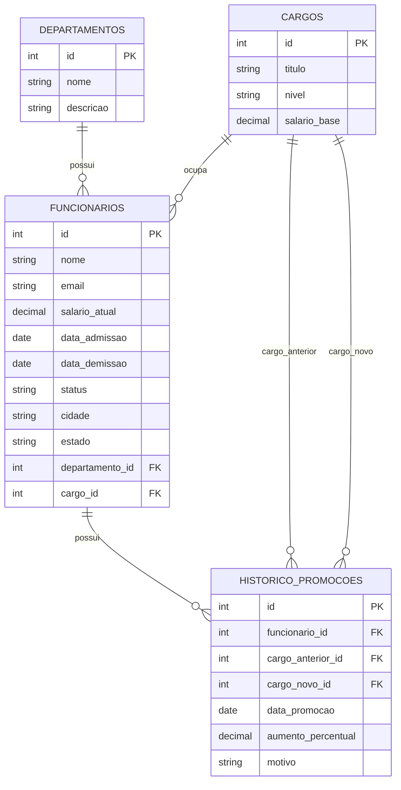
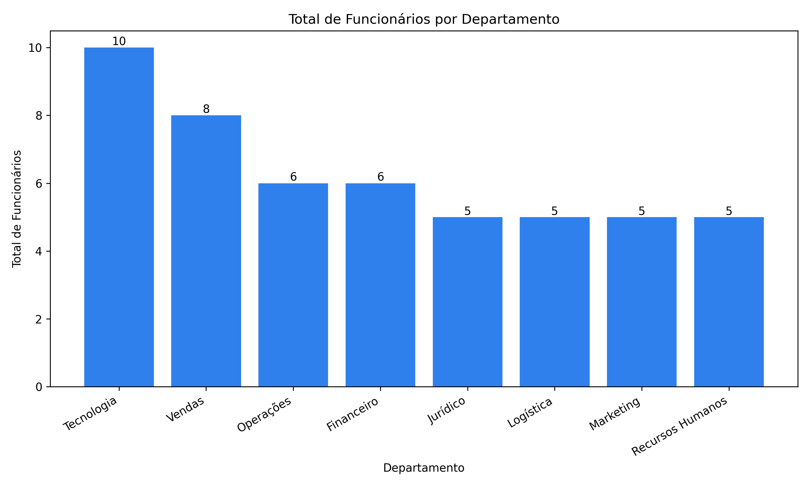
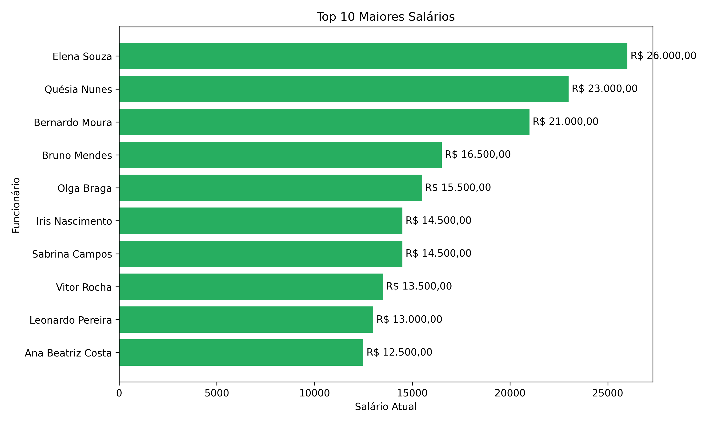
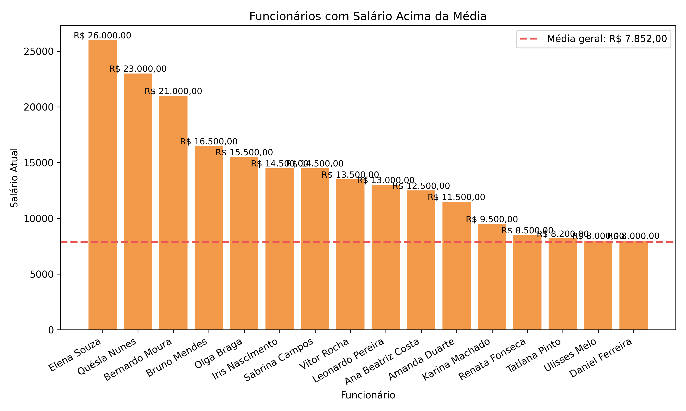

# Projeto RH - Python + SQL Server


## Sobre o projeto

Este projeto foi desenvolvido para praticar integração entre **Python**, **SQL Server** e **SQLAlchemy** em um cenário de análise de Recursos Humanos.

O banco simula uma estrutura de RH contendo informações sobre funcionários, departamentos, cargos e histórico de promoções. Além das consultas analíticas, o projeto também gera gráficos a partir dos dados consultados.

## Objetivo

Criar uma aplicação Python conectada ao SQL Server para:

- criar as tabelas do banco de dados;
- inserir dados simulados de RH;
- executar consultas analíticas;
- exibir resultados no terminal;
- gerar gráficos das principais análises.

## Tecnologias utilizadas

- Python
- SQL Server
- SQLAlchemy
- PyODBC
- Matplotlib
- GitHub
- Mermaid para documentação do ERD

## Estrutura do banco de dados

O projeto possui as seguintes tabelas:

- `departamentos`
- `cargos`
- `funcionarios`
- `historico_promocoes`

## Diagrama do banco de dados - ERD



## Modelo relacional

```text
departamentos
    └── funcionarios

cargos
    └── funcionarios

funcionarios
    └── historico_promocoes

cargos
    ├── historico_promocoes.cargo_anterior_id
    └── historico_promocoes.cargo_novo_id
```

## Estrutura do repositório

```text
Projeto_RH_Python/
│
├── README.md
├── requirements.txt
│
├── database.py
├── models.py
├── seed.py
├── queries.py
├── main.py
├── graphs.py
│
└── graficos/
    ├── total_funcionarios_por_departamento.png
    ├── top_10_maiores_salarios.png
    └── funcionarios_acima_media.png
```

## Descrição dos scripts

### `database.py`

Arquivo responsável pela conexão com o SQL Server.

Configura:

- servidor SQL Server;
- banco de dados `ProjetoRH`;
- string de conexão via `pyodbc`;
- engine do SQLAlchemy;
- sessão local;
- classe base dos modelos ORM.

```python
SERVER = "localhost"
DATABASE = "ProjetoRH"
```

### `models.py`

Arquivo responsável pela modelagem ORM das tabelas.

Classes implementadas:

- `Departamento`
- `Cargo`
- `Funcionario`
- `HistoricoPromocao`

Cada classe representa uma tabela do banco de dados e define colunas, chaves primárias, chaves estrangeiras e relacionamentos.

### `seed.py`

Arquivo responsável pela criação das tabelas e inserção dos dados iniciais.

Funções principais:

- `criar_banco()`
- `inserir_dados()`

Observação: a função `inserir_dados()` insere registros fixos. Caso seja executada várias vezes, pode gerar dados duplicados se não houver tratamento adicional de unicidade.

### `queries.py`

Arquivo responsável pelas consultas analíticas.

Consultas implementadas:

- total de funcionários por departamento;
- média salarial geral;
- top 10 maiores salários;
- funcionários acima da média salarial;
- turnover por departamento.

### `main.py`

Arquivo principal do projeto.

Responsável por:

- criar as tabelas no banco;
- opcionalmente carregar os dados;
- exibir no terminal os resultados das análises.

Por padrão, o carregamento de dados está desativado:

```python
executar(carregar_dados=False)
```

Para carregar os dados iniciais:

```python
executar(carregar_dados=True)
```

### `graphs.py`

Arquivo responsável pela geração dos gráficos das análises.

Gráficos gerados:

- total de funcionários por departamento;
- top 10 maiores salários;
- funcionários com salário acima da média.

Os arquivos são salvos automaticamente na pasta `graficos`.

## Consultas implementadas

### Total de funcionários por departamento

```python
def total_funcionarios_por_departamento():
    session = SessionLocal()

    resultado = (
        session.query(
            Departamento.nome.label("departamento"),
            func.count(Funcionario.id).label("total_funcionarios")
        )
        .join(Funcionario, Funcionario.departamento_id == Departamento.id)
        .group_by(Departamento.nome)
        .order_by(desc("total_funcionarios"))
        .all()
    )

    session.close()
    return resultado
```

### Média salarial geral

```python
def media_salarial_geral():
    session = SessionLocal()

    resultado = session.query(
        func.avg(Funcionario.salario_atual).label("media_salarial")
    ).scalar()

    session.close()
    return resultado
```

### Top 10 maiores salários

```python
def top_10_maiores_salarios():
    session = SessionLocal()

    resultado = (
        session.query(
            Funcionario.nome,
            Departamento.nome.label("departamento"),
            Cargo.titulo.label("cargo"),
            Funcionario.salario_atual
        )
        .join(Departamento, Departamento.id == Funcionario.departamento_id)
        .join(Cargo, Cargo.id == Funcionario.cargo_id)
        .order_by(Funcionario.salario_atual.desc())
        .limit(10)
        .all()
    )

    session.close()
    return resultado
```

### Funcionários acima da média salarial

```python
def funcionarios_acima_media():
    session = SessionLocal()

    media = session.query(func.avg(Funcionario.salario_atual)).scalar()

    resultado = (
        session.query(Funcionario.nome, Funcionario.salario_atual)
        .filter(Funcionario.salario_atual > media)
        .order_by(Funcionario.salario_atual.desc())
        .all()
    )

    session.close()
    return resultado
```

## Gráficos desenvolvidos

### Total de funcionários por departamento



### Top 10 maiores salários



### Funcionários acima da média



## Exemplos de análises

- Quantidade de funcionários por departamento
- Média salarial geral
- Funcionários com maiores salários
- Funcionários acima da média salarial
- Quantidade de desligados por departamento
- Análise de distribuição de funcionários
- Análise visual de salários
- Base para evolução futura em indicadores de RH

## Como executar o projeto

### 1. Criar o banco no SQL Server

Crie manualmente o banco de dados no SQL Server:

```sql
CREATE DATABASE ProjetoRH;
```

### 2. Instalar as dependências

No terminal, execute:

```bash
pip install -r requirements.txt
```

### 3. Validar a conexão

O projeto utiliza conexão local com autenticação integrada do Windows:

```python
mssql+pyodbc://@localhost/ProjetoRH?driver=ODBC+Driver+17+for+SQL+Server&trusted_connection=yes
```

Verifique se o driver abaixo está instalado:

```text
ODBC Driver 17 for SQL Server
```

### 4. Criar tabelas e inserir dados

Para criar as tabelas e carregar os dados iniciais:

```bash
python seed.py
```

Importante: execute a carga inicial apenas quando necessário, pois os inserts não possuem validação de duplicidade.

### 5. Executar as análises no terminal

```bash
python main.py
```

### 6. Gerar os gráficos

```bash
python graphs.py
```

Os gráficos serão salvos na pasta:

```text
graficos/
```

## Conteúdo desenvolvido

### Nível básico

- Criação de conexão com SQL Server
- Criação de tabelas via SQLAlchemy ORM
- Inserção de registros simulados
- Consultas agregadas
- Exibição de resultados no terminal

### Nível intermediário

- Relacionamentos entre tabelas
- JOINs via SQLAlchemy
- Filtros analíticos
- Ordenação de resultados
- Separação do projeto em módulos

### Nível avançado

- Modelagem ORM
- Reaproveitamento de consultas
- Geração de gráficos com Matplotlib
- Organização de scripts por responsabilidade
- Base para construção de indicadores de RH

## Boas práticas aplicadas

- Separação entre conexão, modelos, carga, consultas e visualizações
- Uso de ORM para representar tabelas e relacionamentos
- Funções reutilizáveis para consultas analíticas
- Geração automática de gráficos em pasta específica
- Estrutura simples e adequada para estudos e portfólio

## Melhorias futuras

- Evitar duplicidade na carga inicial de dados
- Criar arquivo `.env` para parametrizar servidor e banco
- Adicionar consultas de média salarial por departamento
- Corrigir e validar a análise de turnover por departamento
- Criar testes automatizados
- Exportar análises para CSV ou Excel
- Criar dashboard em Power BI usando este banco como fonte

## Aprendizados

Durante o desenvolvimento deste projeto foram praticados conceitos como:

- conexão Python com SQL Server;
- criação de engine com SQLAlchemy;
- modelagem ORM;
- relacionamentos entre tabelas;
- chaves primárias e estrangeiras;
- consultas agregadas;
- joins;
- análise salarial;
- geração de gráficos;
- organização de projeto Python para dados.

## Autor

Daniel Augusto Gomes

LinkedIn:  
https://www.linkedin.com/in/danielaugustogomes/


